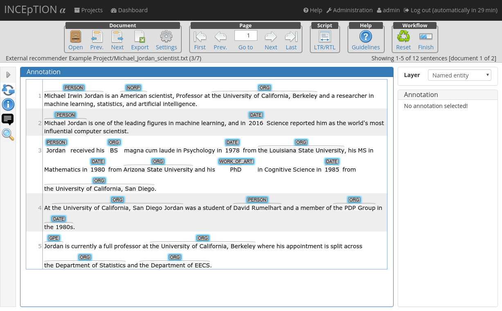

See also: [Implementing an external recommender in Python - a tutorial][2]

This example provides a ready-to-use project show-casing the use of an *External Recommender* in INCEpTION for annotating named entities
and part-of-speech tags. Recommenders provide interactive annotation support by suggesting
potential labels.

External recommenders are web services that expose a machine learning classifier over a HTTP web service.
They can predict annotations for given documents and optionally be trained on new data. The external recommender
support in INCEpTION allows to e.g. integrate custom classifiers written in a different programming language
or to use an already pre-trained model.

The protocol used by INCEpTION to communicate with an external recommender is documented in the [INCEpTION Developer Guide](https://zoidberg.ukp.informatik.tu-darmstadt.de/jenkins/job/INCEpTION%20(GitHub)%20(master)/de.tudarmstadt.ukp.inception.app$inception-app-webapp/doclinks/3/#_external_recommender_api_overview).

To get started with external recommenders, we provide a external recommender implementation based on [spaCy](https://spacy.io/) that 
can serve as examples and as a basis for custom implementations. spaCy is an open-source software library 
for advanced Natural Language Processing for Python. It currently offers statistical neural network models for e.g. part-of-speech tagging, dependency
parsing, named entity recognition in many different languages. The corresponding INCEpTION external recommender
uses the [Flask](http://flask.pocoo.org/) Python framework to expose POS and NER prediction. The spaCy recommender is available on [Github](https://github.com/inception-project/external-recommender-spacy). The GitHub repository contains documentation and an installation guide.

## Example INCEpTION project

The INCEpTION project for this example contains two documents without annotations. They contain many named 
entities and tokens with diverse part of speech:

* **Michael\_Jordan\_scientist.txt**: A short article about Michael I. Jordan (scientist).
* **Wikipedia-Obama.txt**: A short excerpt from the Wikipedia page of Barack Obama.

The following recommenders are configured in this project:

* Named entity value: External recommender
* Parts-of-speech: External recommender

They are configured with a dummy remote URL and are disabled by default. In order to use them, set up an
external recommender based on the [spaCy recommender](https://github.com/inception-project/external-recommender-spacy) according
to the documentation in its repository. Alternatively, you can use your own implementation.

Back in INCEpTION, go to the _Project settings_ under the _Recommender_ tab, enter the URL of your recommender as the remote URL and 
enable the recommender. Make sure to append `ner` or `pos` to the server URL, e.g. `http://localhost:5000/ner`. It is recommended to
 not enable both POS and NER at the same time, as it adds visual clutter.

When everything is configured, switch to the annotation page and open the document. After performing an action, 
e.g. making an annotation, the recommendations are shown above the tokens. A detailed description for using a recommender 
can be found in the [INCEpTION user guide](https://zoidberg.ukp.informatik.tu-darmstadt.de/jenkins/job/INCEpTION%20(GitHub)%20(master)/de.tudarmstadt.ukp.inception.app$inception-app-webapp/doclinks/1/#sect_annotation_recommendation).

The following images show the spaCy recommender in action. The first picture shows suggestions for named entities, the
second one for parts-of-speech tags.

[1]: https://github.com/inception-project/inception-external-recommender/blob/master/Tutorial.ipynb